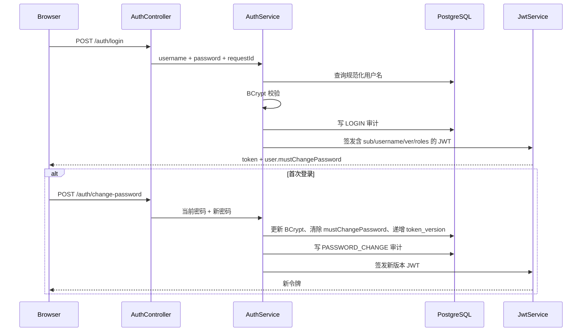

# F01 登录、用户与 RBAC：As-Built 学习文档

> 状态：已完成  
> 对应分支：`feature/f01-identity-rbac`  
> 最后校验：2026-09-18  
> 设计基线：`docs/system-design.md` v1.0，需求 FR-IAM-001～FR-IAM-006

## 1. 模块目标与业务价值

F01 为 OpsPilot 建立第一个真实业务安全边界：用户必须先完成身份验证，后端依据角色决定能否访问管理接口，所有重要身份操作均可追踪。它为后续事故、审批、Agent、配置和数据运维模块提供统一的用户主体、角色集合与审计基础。

本模块交付：

- 登录、退出、当前用户查询、会话失效与首次登录改密；
- 用户分页查询、新增、启停、重置密码和角色替换；
- `VIEWER`、`OPERATOR`、`APPROVER`、`ADMIN` 四角色模型；
- 前端菜单/路由控制与后端强制鉴权；
- 初始化管理员、写操作幂等、管理员保护和审计日志；
- RFC 9457 风格错误、Request ID 和可复现的 PostgreSQL 全栈验证。

## 2. 需求与验收对应

| 需求 | 实际实现 | 主要验收证据 |
|---|---|---|
| FR-IAM-001 | `/auth/login`、`/logout`、`/me`，JWT 过期或版本不符返回 401 | `IdentityApiIntegrationTest` 的错误密码、过期令牌、退出失效用例 |
| FR-IAM-002 | 用户列表、创建、启停、重置密码、替换角色 | 集成测试覆盖每个管理接口；真实 E2E 创建 VIEWER |
| FR-IAM-003 | 四角色枚举与数据库种子 | `RoleName`、Flyway V2、四角色 API 矩阵 |
| FR-IAM-004 | 前端隐藏管理入口和深链守卫；后端 `/users/**` 要求 ADMIN | 模拟/真实 Playwright；真实 API 403 与审计记录 |
| FR-IAM-005 | 启动时幂等创建管理员并强制首次改密 | 空库集成测试及真实 Compose 首登改密 |
| FR-IAM-006 | 登录、退出、鉴权失败和用户管理操作写审计 | 集成断言；真实环境审计事件分组查询 |

验收口径还包括：禁用、退出、改密、重置密码和角色变化后旧令牌立即失效；不允许管理员禁用自己、移除自己的 ADMIN，或破坏“至少一个启用管理员”约束；审计不保存明文密码。

## 3. 职责、边界与上下游

```text
React 页面
   │  JSON + Bearer JWT + X-Request-ID
   ▼
AuthController / UserController
   │
   ├── Security filters ── JWT 校验、用户现状重载、RBAC、首次改密限制
   │
   ├── AuthService ─────── 登录、退出、改密
   └── UserManagementService
           ├── UserRepository / IdentityIdempotencyRepository
           └── AuditService
                    │
                    ▼
       PostgreSQL: app_user / role / user_role /
                   identity_idempotency / audit_log
```

身份模块不依赖 MCP、示例服务、Agent、Skill、RAG 或模型 Provider。后续模块只能消费已认证主体及角色，不能绕过该模块直接信任前端声明。F01 复用 F00 的 Spring Boot、Flyway、PostgreSQL、React、质量门禁和 Compose，不重新实现工程基础。

## 4. 实际架构与核心流程

### 4.1 登录与首次改密



登录失败统一返回 `INVALID_CREDENTIALS`，不暴露用户名是否存在。前端把令牌放在 `sessionStorage`，浏览器会话关闭后不长期保留；刷新时调用 `/auth/me` 恢复主体。

### 4.2 每请求鉴权与即时失效

`JwtAuthenticationFilter` 不只校验 JWT 签名、issuer 与过期时间，还按 `sub` 重新加载用户和当前角色，并比较 JWT 的 `ver` claim 与数据库 `token_version`。禁用、退出、改密、重置密码或角色替换都会递增版本，所以旧令牌下一次请求立即得到 401。

这一策略用一次数据库查询换取简单、确定的即时撤销，不需要额外维护黑名单。若未来吞吐量成为瓶颈，可以把用户安全版本放入短 TTL 缓存，但必须设计可靠失效机制。

### 4.3 RBAC 与首次改密限制

`SecurityConfiguration` 对 `/api/v1/users/**` 强制 `ADMIN`，其余 `/api/v1/**` 要求认证。`PasswordChangeRequiredFilter` 在 `mustChangePassword=true` 时只允许 `/auth/me`、`/auth/change-password` 和 `/auth/logout`。前端同时隐藏菜单并阻止 `/users` 深链，但后端 403 才是安全边界。

### 4.4 用户管理与幂等

创建用户和重置密码要求 `Idempotency-Key`。服务端保存“操作者 + 操作类型 + key + 请求指纹 + 目标用户”：

1. 首次请求执行业务并记录结果；
2. 相同 key、相同指纹返回原目标；
3. 相同 key、不同指纹返回 409；
4. 事务保证业务写入、幂等记录和审计共同提交或回滚。

## 5. 数据库导航

迁移文件：`apps/ops-pilot-api/src/main/resources/db/migration/V2__create_identity_and_audit_tables.sql`。V1 未被修改。

| 表 | 用途 | 关键约束 |
|---|---|---|
| `role` | 四个固定角色 | `name` 唯一并以 V2 种子写入 |
| `app_user` | 账号、安全状态和 BCrypt 摘要 | `username` 唯一；`token_version >= 0` |
| `user_role` | 用户到角色的多对多关系 | 复合主键与外键级联 |
| `identity_idempotency` | 创建/重置写操作去重 | 操作者、操作、key 唯一 |
| `audit_log` | 不可变式身份操作记录 | 事件、结果、主体、目标、Request ID、前后值和时间 |

Java `Instant` 在 JDBC 边界转换成 UTC `OffsetDateTime`，避免 PostgreSQL 驱动无法推断裸 `Instant` SQL 类型。

## 6. API 与前端导航

完整契约：`docs/openapi/identity-v1.yaml`。

| 方法与路径 | 权限 | 说明 |
|---|---|---|
| `POST /api/v1/auth/login` | 匿名 | 登录 |
| `POST /api/v1/auth/logout` | 已认证 | 递增安全版本并退出 |
| `GET /api/v1/auth/me` | 已认证 | 恢复当前主体 |
| `POST /api/v1/auth/change-password` | 已认证 | 首次或主动改密 |
| `GET /api/v1/users` | ADMIN | 分页、搜索与受控排序 |
| `POST /api/v1/users` | ADMIN | 幂等创建用户 |
| `PATCH /api/v1/users/{id}/status` | ADMIN | 启用或禁用 |
| `POST /api/v1/users/{id}/reset-password` | ADMIN | 幂等重置临时密码 |
| `PUT /api/v1/users/{id}/roles` | ADMIN | 原子替换角色集合 |

前端入口集中在 `web/src/App.tsx`：未登录显示登录页；首次登录显示改密页；正常主体进入概览；ADMIN 可进入 `/users`。`web/src/api.ts` 统一附加 Bearer token、解析 Problem Details，并把 `requestId` 带到错误提示。

## 7. 代码导航与分步阅读

建议按以下顺序阅读：

1. `V2__create_identity_and_audit_tables.sql`：先理解持久化不变量；
2. `RoleName`、`UserAccount`、`PasswordPolicy`、`UserRepository`：领域数据和端口；
3. `JdbcUserRepository`、`IdentityIdempotencyRepository`：SQL 与时间类型边界；
4. `AuthService`：登录、退出、改密和统一错误；
5. `UserManagementService`：输入校验、管理员保护、幂等与审计；
6. `JwtService`、`JwtAuthenticationFilter`、`PasswordChangeRequiredFilter`：令牌生命周期；
7. `SecurityConfiguration`：URL 授权矩阵和 401/403 处理；
8. `AuthController`、`UserController`、`GlobalExceptionHandler`：HTTP 契约；
9. `web/src/api.ts`、`web/src/App.tsx`：浏览器状态机与管理交互；
10. `IdentityApiIntegrationTest`、`App.test.tsx`、两个 Playwright spec：可执行行为定义。

## 8. 难点与技术亮点

### 8.1 令牌版本实现即时撤销

- 问题：纯自包含 JWT 在到期前通常无法撤销。
- 选择：每次请求把 claim `ver` 与数据库 `token_version` 比较。
- 替代：短令牌、服务端 session、JWT 黑名单或 Redis 安全版本缓存。
- 代价：每个认证请求增加一次数据库读取。
- 位置：`JwtAuthenticationFilter`、`AuthService`、`JdbcUserRepository`。
- 证据：禁用、退出、改密、重置和角色变化后的旧令牌集成测试均通过。

### 8.2 数据库级幂等与请求指纹

- 问题：浏览器重试可能重复创建账号或多次重置密码。
- 选择：持久化幂等键，并用 SHA-256 指纹阻止同 key 被不同载荷复用。
- 替代：只依赖唯一约束，或使用短期内存/Redis 去重。
- 代价：多一张表，必须设计记录保留和未来清理策略。
- 位置：`IdentityIdempotencyRepository`、`UserManagementService`。
- 证据：集成测试验证相同请求重放与冲突请求 409。

### 8.3 审计与业务事务一致

- 问题：业务成功但审计缺失，或审计成功但业务回滚都会破坏追踪。
- 选择：成功审计跟随业务事务；预期业务失败通过 `REQUIRES_NEW` 保留失败审计。
- 替代：同步消息、Outbox 或独立审计服务。
- 代价：审计数据库不可用会影响身份操作；跨服务后应演进为 Outbox。
- 位置：`AuditService`、`AuthService`、`UserManagementService`。
- 证据：真实 Compose 查询得到 LOGIN、LOGOUT、PASSWORD_CHANGE、USER_CREATED、AUTHORIZATION_FAILURE，且已知明文密码命中数为 0。

## 9. 方案权衡

- 使用 HMAC HS256：单体本地部署配置简单；分布式多签发方场景应考虑非对称密钥与轮换/JWKS。
- 使用 JDBC 而不是 ORM：SQL、分页和锁定行为显式，迁移契约清楚；代价是映射代码更多。
- BCrypt cost 12：适合当前本地与演示负载；生产应基于目标硬件重新测量登录延迟。
- 不实现 refresh token：F01 的 15 分钟访问令牌和重新登录足够；引入 refresh token 会增加存储、轮换、盗用检测与撤销复杂度。
- 前端使用轻量路径状态而非路由库：满足 F01 登录和 `/users`；复杂嵌套路由留给 F02 统一前端框架。

## 10. Agent、MCP、Skill、RAG 与模型关系

F01 不调用模型，不加载 Skill，不连接 MCP，也不读写 RAG。它只建立这些后续能力必须复用的认证主体和 RBAC 基础。任何未来 Agent 工具调用都必须从可信服务端上下文取得用户与角色，不能接受模型输出或前端请求体自报权限。

## 11. 安全、异常与恢复

- 密码只保存 BCrypt 摘要，cost 为 12；策略要求 12～128 位且包含大小写、数字、符号。
- 默认管理员密码和 JWT secret 仅为本地占位值，`.env` 不提交；共享环境必须覆盖。
- 登录错误不区分用户不存在和密码错误，减少账号枚举信息。
- 管理员不能禁用自己、移除自己的 ADMIN，也不能禁用或降级最后一个启用管理员。
- 所有 API 错误返回 `application/problem+json`、稳定 `errorCode` 和 UUID Request ID。
- 客户端可传合法 UUID `X-Request-ID`；非法值被替换，响应回传最终 ID。
- 审计快照只记录用户名、显示名、状态、首次改密标记和角色，不记录密码或摘要。
- 数据恢复依赖 Flyway 从 V1 升到 V2；完整备份/恢复属于 F16。

## 12. 测试范围与真实结果

### 12.1 后端

使用 Temurin JDK 21.0.12.1：

```powershell
.\mvnw.cmd -B -ntp verify
```

结果：Reactor 6/6 SUCCESS；API 5 个测试通过、0 失败、0 跳过；Testcontainers 实际启动 pgvector PostgreSQL 16，从空库应用 Flyway V1/V2；Checkstyle 0、SpotBugs 0；API JaCoCo 行覆盖率 623/671，即 92.85%。

`IdentityApiIntegrationTest` 覆盖四角色矩阵、首次改密、错误密码、过期/撤销令牌、禁用/启用、重置密码、即时角色变化、自我与最后管理员保护、幂等重放/冲突、分页排序、审计和密码脱敏。

### 12.2 前端

```powershell
npm run lint
npm run format:check
npm run test
npm run build
```

结果：lint、格式和构建通过；Vitest 12/12，通过率 100%；Statements 89.42%、Branches 80.34%、Functions 90.47%、Lines 89.18%。

### 12.3 浏览器与全栈

```powershell
npm run test:e2e
$env:E2E_LIVE='true'
npm run test:e2e -- e2e/identity-live.spec.ts
docker compose -p ops-pilot-f01-test up -d --build --wait --wait-timeout 300
```

结果：模拟 Playwright 2/2 通过（live spec 正常跳过）；真实 API Playwright 1/1 通过；真实流程完成管理员首登改密、创建 VIEWER、VIEWER 首登改密、前端隐藏/深链阻止和后端 403。完整 Compose 构建 6 个应用镜像，10 个服务运行，9 个声明 healthcheck 的容器均 healthy；Web、5 个 Java readiness、Grafana 和 Jaeger 返回 200；Prometheus 5/5 targets up；日志无 error-level/exception 命中。测试后隔离容器、网络和三个隔离卷已删除。

### 12.4 发现并修复的问题

- PostgreSQL JDBC 不能推断裸 `Instant`：边界改用 UTC `OffsetDateTime`。
- SpotBugs 首次报告 28 项：复制可变集合、校验 JWT subject、固定 Locale、收紧 Request ID，并只对 Spring 注入误报添加有理由的局部抑制。
- 前端分支覆盖率首次为 79.48%：增加用户列表 401 会话失效测试后达到 80.34%，未降低阈值。
- 真实 E2E 首次因“临时密码”定位器同时命中重置输入框失败：改为 exact label，重建隔离数据库后通过。
- 一次 Maven 命令使用系统 Java 8，被 Enforcer 正确拒绝；切换到 JDK 21 后执行真实验证。

## 13. 常见问题与调试

1. Maven 提示需要 JDK 21：检查 `java -version`、`JAVA_HOME` 和 `PATH`，不要绕过 Enforcer。
2. 登录后持续要求改密：确认调用 `/auth/change-password` 成功，并使用响应中的新 token 替换旧 token。
3. 管理员接口返回 401：检查 token 是否过期，或账号的 `token_version` 是否因退出、改密、禁用、重置或改角色而增加。
4. 管理员接口返回 403：检查数据库当前角色；前端菜单可见性不是授权依据。
5. 重试写请求返回 409：同一个 `Idempotency-Key` 被不同请求体复用，应为新的业务意图生成新 key。
6. 错误难追踪：复制页面显示的 Request ID，在响应头、Problem Details 与 `audit_log.request_id` 间关联。
7. Testcontainers 跳过：确认 Docker Engine 可连接；F01 正式验收要求 0 skipped，不能把无 Docker 的跳过当成通过。

## 14. 面试问题与回答思路

1. 为什么 JWT 校验后还查数据库？为了即时禁用、退出、改密和角色变更；代价是每请求一次读取，可用可靠失效缓存优化。
2. 前端隐藏按钮为什么不等于权限控制？浏览器可绕过 UI 直接发请求；真正边界是 Spring Security 的后端 403。
3. 如何避免 JWT 黑名单无限增长？本实现使用单调 `token_version`，撤销一个用户的全部旧令牌只需更新一行。
4. 为什么幂等记录要带请求指纹？同 key 同载荷可重放，同 key 不同载荷必须冲突，否则客户端错误会悄悄改变语义。
5. 失败审计为什么可能需要新事务？业务事务回滚时仍需保存可信失败事实；但要避免把密码写入原因或快照。
6. 怎样保护最后一个管理员？应用服务在事务内检查启用管理员计数并禁止破坏约束；高并发生产场景还可增加锁或数据库级策略。

## 15. 独立改造练习

1. 为登录增加基于用户名和来源地址的速率限制，并补并发与恢复测试。
2. 实现 access/refresh token 轮换、refresh token 重用检测和单设备退出。
3. 把用户安全版本放入短 TTL 缓存，设计禁用时可靠失效，并量化数据库读取下降。
4. 增加角色权限表，把 URL 角色判断演进为细粒度 permission，同时保持四角色默认映射。
5. 为审计日志实现分页只读 API 和管理员页面，验证敏感字段脱敏。
6. 使用并发集成测试验证“最后一个管理员”保护，并选择悲观锁或数据库约束方案。

## 16. 简历表达

可基于真实实现表述为：

> 为 Spring Boot 4 + React 运维平台实现完整身份与 RBAC 模块：基于 BCrypt 和 HS256 JWT 构建登录、首次改密与四角色鉴权，通过数据库 `token_version` 实现禁用、退出、改密和角色变化后的令牌即时撤销；为用户创建和密码重置设计持久化幂等键与请求指纹，并建立含 Request ID 的脱敏审计链路。使用 Testcontainers PostgreSQL、Vitest、Playwright 和 10 服务 Compose 栈验证，后端行覆盖率 92.85%，前端四项覆盖率均超过 80%。

## 17. 参考资料

- Spring Security JWT：<https://docs.spring.io/spring-security/reference/servlet/oauth2/resource-server/jwt.html>
- Spring Security 请求授权：<https://docs.spring.io/spring-security/reference/servlet/authorization/authorize-http-requests.html>
- Testcontainers PostgreSQL：<https://java.testcontainers.org/modules/databases/postgres/>
- Spring Boot Testcontainers：<https://docs.spring.io/spring-boot/reference/testing/testcontainers.html>
