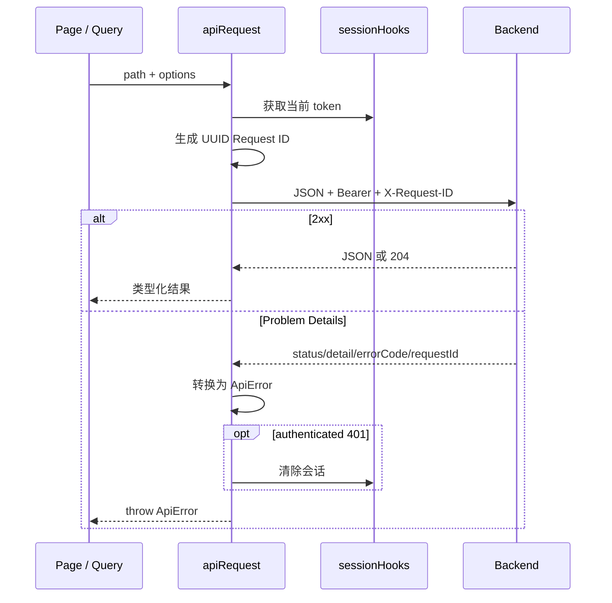

# F02 前端框架与统一体验：As-Built 学习文档

> 状态：已完成
>
> 对应分支：`feature/f02-frontend-foundation`
>
> 最后校验：2026-09-19
>
> 设计基线：`docs/system-design.md` v1.0，需求 FR-UX-001～FR-UX-006

## 1. 模块目标与业务价值

F02 把 F01 的最小身份页面升级为后续业务切片可以持续复用的前端产品骨架。它统一页面结构、请求与会话行为、数据列表、异常反馈、危险操作确认和可访问性，避免事故、审批、Agent、知识库等模块各自实现一套交互约定。

本模块交付：

- 基于 React Router、Ant Design 和 TanStack Query 的应用壳；
- 主导航、面包屑、用户菜单、会话恢复和角色路由守卫；
- 自动附加 JWT 与 Request ID 的统一 API 客户端；
- 服务端分页表格、查询条件 URL 同步和标准页面状态；
- 状态、风险、置信度、JSON、日志、Trace 与危险操作组件；
- 403、404、500、全局错误边界及桌面响应式基线；
- Vitest 覆盖率门禁与 Playwright 浏览器回归。

## 2. 需求与验收对应

| 需求 | 实际实现 | 主要验收证据 |
|---|---|---|
| FR-UX-001 | 固定侧栏、顶部栏、面包屑与用户菜单 | 登录单测与 Playwright 管理员场景 |
| FR-UX-002 | TanStack Query 查询/变更、统一错误和重试 | 用户列表、500 后重试和 CRUD 单测 |
| FR-UX-003 | JWT、`X-Request-ID`、401 会话清理 | 请求头、恢复会话与过期会话单测 |
| FR-UX-004 | 表格、空/加载/错误、标签、内容查看器、二次确认 | `foundation.test.tsx` 与体验基线页 |
| FR-UX-005 | Label、键盘焦点、桌面布局、403/404/500 | 路由单测、CSS 焦点规则和浏览器回归 |
| FR-UX-006 | 刷新恢复令牌、URL 查询状态和深链 | `/me` 恢复、查询参数与权限深链用例 |

## 3. 职责、边界与上下游

```text
BrowserRouter + SessionRouter
          │
          ├── ConsoleLayout ── 导航 / 面包屑 / 用户菜单
          │
          ├── 业务页面 ─────── Query / Mutation / URL 状态
          │        │
          │        └── 通用组件：表格、标签、内容查看、确认框
          │
          └── apiRequest ───── JWT + Request ID + Problem Details
                                      │
                                      ▼
                              F01 REST API / RBAC
```

F02 负责浏览器端体验和客户端状态，不替代后端鉴权、业务事务、审计或幂等保护。菜单隐藏和路由守卫只改善体验；真正的安全边界仍由 F01 API 执行。后续前端切片应复用 `ConsoleLayout`、统一请求层和通用组件，而不是复制其实现。

## 4. 实际架构与核心流程

### 4.1 启动与会话恢复

`App` 建立 Ant Design 主题、消息上下文、QueryClient、Router 和全局错误边界。`SessionRouter` 从 `sessionStorage` 读取访问令牌：有令牌时调用 `/auth/me` 恢复用户；401 时清除本地令牌并显示会话过期提示；没有令牌时进入登录页。

系统当前没有 refresh token。这里的“刷新策略”是浏览器刷新后的会话恢复，而不是静默续期：令牌有效则恢复页面，失效则回到登录页。这与 F01 的即时令牌撤销模型一致，也避免伪造一个后端尚未支持的刷新协议。

### 4.2 统一请求与错误传播



每次请求生成客户端 Request ID；如果错误响应带服务端 Request ID，则优先展示服务端值。恢复 `/me` 时使用 `retryUnauthorized` 标记避免重复触发全局清理，恢复流程自身负责把状态归一化。

### 4.3 服务端列表与 URL 状态

用户页从 `page`、`size`、`query`、`sort` 查询参数派生 Query Key。查询、排序或分页变化通过 `setSearchParams(..., { replace: true })` 写回 URL，因此刷新和分享深链都能恢复当前视图。`keepPreviousData` 在翻页期间保留上一页，表格用加载态明确表示正在请求。

写操作由一个统一 mutation 调度。成功后失效 `['users']` 查询、关闭对话框并显示与实际影响匹配的消息；失败则显示后端错误。创建与重置密码仍由 API 层生成幂等键。

### 4.4 错误分层

- 请求错误：`RequestError` 展示消息、错误码、Request ID 和重试入口；
- 权限错误：路由守卫渲染 403 页面，后端仍会独立返回 403；
- 未知路由：专用 404 页面；
- 路由级演示失败：专用 500 页面；
- 意外渲染异常：`GlobalErrorBoundary` 捕获并提供返回首页操作。

## 5. 状态与数据导航

F02 不新增数据库表。主要浏览器状态如下：

| 状态 | 存储位置 | 生命周期 |
|---|---|---|
| JWT | `sessionStorage['ops-pilot.access-token']` | 当前浏览器会话 |
| 当前用户 | `SessionRouter` React state | 页面运行期间，可由 `/me` 恢复 |
| 服务端查询缓存 | TanStack QueryClient | 页面运行期间，`staleTime` 15 秒 |
| 页码、页大小、筛选、排序 | URL search params | 刷新、前进后退与深链可恢复 |
| 表单和对话框 | 组件本地 state / Ant Form | 当前交互期间 |

访问令牌不放入 `localStorage`，降低长期遗留风险。F02 仍无法抵御同源 XSS 读取运行时令牌，因此后续页面必须避免不可信 HTML 注入。

## 6. API 与页面导航

统一 API 位于 `web/src/api.ts`：

| 方法 | 端点 | 页面用途 |
|---|---|---|
| `login` | `POST /api/v1/auth/login` | 登录 |
| `me` | `GET /api/v1/auth/me` | 刷新恢复用户 |
| `logout` | `POST /api/v1/auth/logout` | 用户菜单退出 |
| `changePassword` | `POST /api/v1/auth/change-password` | 首次改密 |
| `users` | `GET /api/v1/users` | 服务端分页列表 |
| `createUser` | `POST /api/v1/users` | 新增用户 |
| `replaceRoles` | `PUT /api/v1/users/{id}/roles` | 编辑角色 |
| `resetPassword` | `POST /api/v1/users/{id}/reset-password` | 重置临时密码 |
| `changeStatus` | `PATCH /api/v1/users/{id}/status` | 启停用户 |

页面路由包括 `/`、`/users`、`/foundation`、`/forbidden`、`/error`、`/login` 和 `/change-password`。未知地址进入 404；非 ADMIN 访问 `/users` 进入 403。

## 7. 代码导航与分步阅读

建议按以下顺序阅读：

1. `web/src/api.ts`：先理解会话 Hook、`ApiError` 和请求封装；
2. `web/src/App.tsx` 的 `App`、`SessionRouter`：理解启动和身份状态机；
3. `ConsoleLayout`：理解导航、面包屑与退出；
4. `UserManagementPage`、`UserEditDialog`：理解 URL、Query 与 Mutation；
5. `web/src/components/foundation.tsx`：理解可复用展示组件；
6. `web/src/styles.css`：检查布局、焦点、断点和内容查看器样式；
7. `App.test.tsx`、`foundation.test.tsx` 与 `e2e/identity.spec.ts`：从验收行为反推设计。

## 8. 难点与技术亮点

### 8.1 会话状态与请求层解耦

`api.ts` 不依赖 React Context，而是通过 `configureApiSession` 注入读取令牌和 401 回调。这样请求层可被独立测试，也避免在每个调用点传 token。代价是它是进程级配置，因此应用启动必须保证 Hook 与当前 Session state 同步。

### 8.2 URL 是列表状态的公开事实源

页码和筛选不只保存在组件 state。URL 驱动 Query Key，使刷新恢复、浏览器历史和可分享链接自然成立，也避免同一页面存在两份相互漂移的查询状态。

### 8.3 危险操作表达实际影响

禁用确认框不只问“是否确认”，还说明已有会话会失效；成功消息同样描述令牌影响。组件把 `impact` 作为必填输入，促使后续业务页面说明风险，而不是套用模糊文案。

### 8.4 泛型服务端表格

`ServerTable<T extends { id: string }>` 统一骨架、空态、横向滚动和分页，同时保留 Ant Design 列定义的类型信息。它不内置具体业务筛选，从而保持组件边界清晰。

## 9. 方案权衡

| 决策 | 收益 | 代价与后续方向 |
|---|---|---|
| Ant Design | 快速建立一致且可访问的企业界面 | 初始 JS 约 1.12 MB；业务模块增加后应路由级拆包 |
| 单一 QueryClient | 统一缓存和失效策略 | 测试需用唯一 Query Key 或清理缓存 |
| `sessionStorage` JWT | 刷新可恢复且不跨浏览器会话长期保留 | 仍受 XSS 风险影响；未来可评估 HttpOnly Cookie |
| 每次 401 清会话 | 行为确定、符合 F01 即时撤销 | 没有无感续期；如引入 refresh token 需后端协议支持 |
| URL 驱动列表状态 | 深链和前进后退天然成立 | 参数解析与默认值需要集中约束 |
| 统一大入口文件 | F02 阶段便于审阅完整骨架 | 后续业务切片应拆出 route/page 模块 |

## 10. Agent、MCP、Skill、RAG 与模型关系

F02 不调用 Agent、MCP、Skill、RAG 或模型 Provider。它提供这些能力未来进入浏览器时需要的展示基础：风险标签、置信度、JSON/日志/Trace 查看器、错误追踪和危险确认。后续模块应把模型结果当作普通服务端数据展示，不能让前端绕过 Policy 或审批直接执行动作。

## 11. 安全、异常与恢复

- 请求自动带 Bearer token，但公开登录明确设置 `authenticated: false`；
- 任何认证请求返回 401 都会清理令牌并回到登录态；
- `/users` 同时有前端角色守卫与后端 ADMIN 鉴权；
- Request ID 可从 UI 直接复制给排障人员；
- 写操作错误不会乐观伪造成功，成功后以服务端重取为准；
- 退出接口即使网络失败也清理本地状态，避免用户被困在半退出界面；
- 403、404、500 和渲染异常都有可恢复入口；
- 表单使用显式 Label、错误提示和可见焦点，危险按钮使用语义与颜色双重提示。

## 12. 测试范围与真实结果

2026-09-19 在分支 `feature/f02-frontend-foundation` 得到以下结果：

| 门禁 | 结果 |
|---|---|
| `npm test` | 2 个文件、25 项测试全部通过 |
| Vitest Statements | 94.14% |
| Vitest Branches | 85.20% |
| Vitest Functions | 89.18% |
| Vitest Lines | 95.27% |
| `npm run lint` | 通过，0 warning |
| `npm run format:check` | 通过 |
| `npm run build` | TypeScript 与 Vite 构建通过 |
| `npm run test:e2e` | 2 项通过，真实 API 场景按设计跳过；无控制台 error |
| `mvnw.cmd -B -ntp verify`（JDK 21） | 6 个 Maven 模块全部成功 |
| Compose 运行态 | 10 个服务运行；Web healthy、HTTP 200、API readiness `UP` |

单测覆盖登录失败、首次改密、刷新恢复、权限守卫、404/500/全局异常、列表筛选分页、错误重试、创建、角色、重置密码、启停、退出失败和 401。组件测试覆盖标签、置信度、查看器、空态和危险确认。

生产构建有一个非阻塞提示：Ant Design 所在初始 JS chunk 超过 Vite 默认 500 kB 警戒线。当前 gzip 后约 352.73 kB，不影响 F02 验收，但应在真实业务页面增长前完成路由级代码拆分。

## 13. 常见问题与调试

### 刷新后为什么回到登录页？

先检查 `sessionStorage` 是否有令牌，再查看 `/api/v1/auth/me` 的状态与 Request ID。401 表示令牌过期、退出、权限版本变化或用户被禁用，前端会有意清理会话。

### 列表参数为什么没有恢复？

检查地址栏是否包含合法的 `page`、`size`、`query`、`sort`。内部页码从 0 开始，Ant Design 分页显示从 1 开始，`ServerTable` 负责转换。

### 为什么按钮隐藏了仍然能直接请求？

按钮隐藏不是安全控制。直接请求能否成功必须由后端 RBAC 决定；若非 ADMIN 得到成功响应，应优先排查 F01 安全配置。

### 为什么 Docker Web 镜像构建会卡在 `npm ci`？

这通常是 Docker 内部访问 npm registry 的网络问题。先用本机 `npm ci`、测试和构建确认代码，再重试镜像构建。不要为了重试而执行 `docker compose down`，以免破坏保留中的本地环境。

### 如何定位生产页面是否部署了最新产物？

比较 `dist/assets` 与 Web 容器 `/usr/share/nginx/html/assets` 的文件名和 SHA-256，并确认容器 healthcheck、首页 200 与 API readiness。

## 14. 面试问题与回答思路

1. 为什么把分页和筛选放进 URL？——说明可恢复、可分享、浏览器历史与 Query Key 一致性。
2. 如何处理 JWT 自动附加和全局 401？——说明会话 Hook、公开请求例外、`ApiError` 与状态归一化。
3. 前端权限守卫能否保证安全？——不能；它只改善 UX，后端 RBAC 才是边界。
4. TanStack Query 与普通 `useEffect` 请求相比解决了什么？——缓存、去重、加载/错误状态、失效和 mutation 编排。
5. 如何设计可复用的危险操作确认？——要求描述影响、明确动作、加载防重复，并让后端保持幂等和鉴权。
6. 怎样验证“统一体验”不是只有截图？——组件单测、路由/会话行为测试、真实浏览器回归、控制台错误断言和运行态健康检查。

## 15. 独立改造练习

1. 把 `/users` 与 `/foundation` 拆为懒加载路由，比较构建 chunk 与首屏加载；
2. 为 URL 参数增加 schema 校验，对非法 sort 和超大 page 提供稳定回退；
3. 增加“复制 Request ID”按钮和成功提示，并补可访问性测试；
4. 为 `ContentViewer` 增加大日志虚拟滚动和搜索高亮；
5. 用独立 QueryClient 测试包装器重构用例，比较测试隔离性和执行时间。

## 16. 简历表达

- 搭建 React 19、TypeScript、Ant Design、React Router 与 TanStack Query 的企业管理端骨架，统一会话、路由、数据请求和异常体验；
- 设计 JWT/Request ID 请求层、服务端分页 URL 状态和可复用风险/内容/确认组件，支撑后续业务模块快速接入；
- 建立 Vitest 80% 四维覆盖率门禁与 Playwright 权限回归，实际达到 94.14% statements、85.20% branches，并通过全仓质量验证。

## 17. 参考资料

- `docs/system-design.md`：总体前端架构、安全与体验要求；
- `docs/implementation-plan.md`：F02 工作包和验收标准；
- `web/src/App.tsx`：应用壳、会话、路由和用户页面；
- `web/src/api.ts`：统一请求层；
- `web/src/components/foundation.tsx`：通用组件；
- `web/src/App.test.tsx`、`web/src/components/foundation.test.tsx`：单元与组件测试；
- `web/e2e/identity.spec.ts`：浏览器权限回归；
- TanStack Query、React Router、Ant Design 和 Vitest 官方文档。
